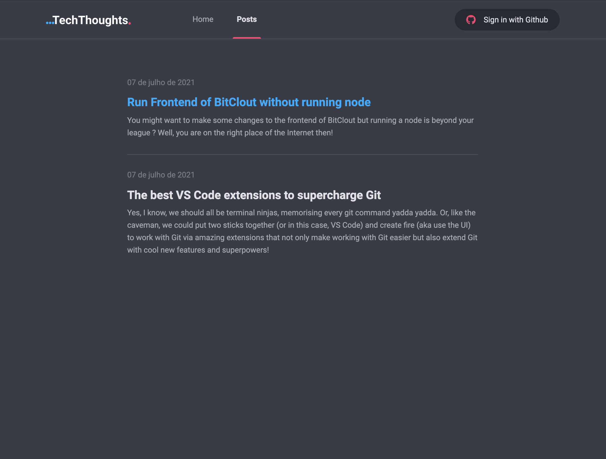
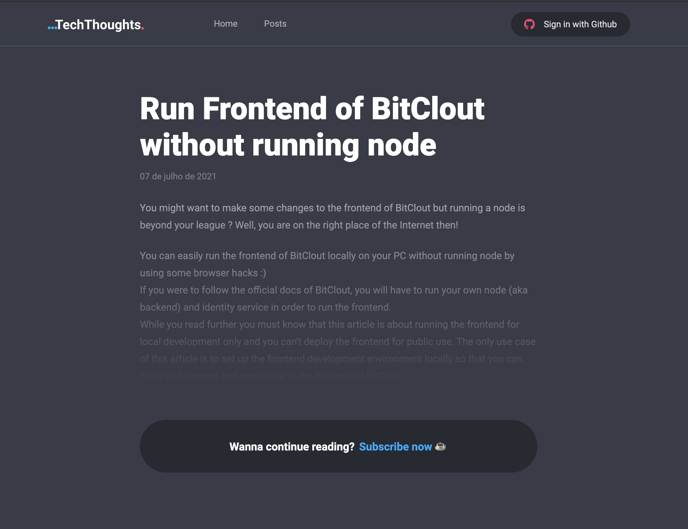
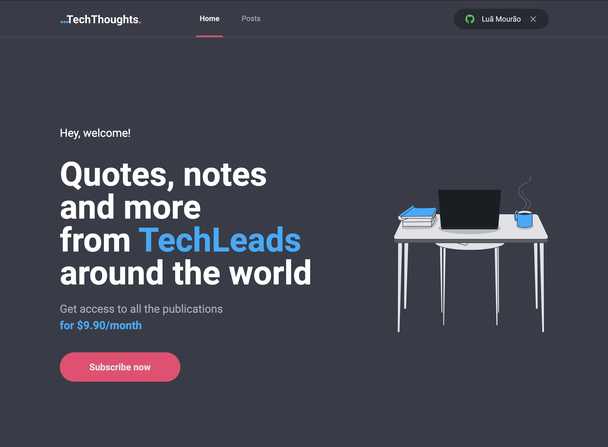
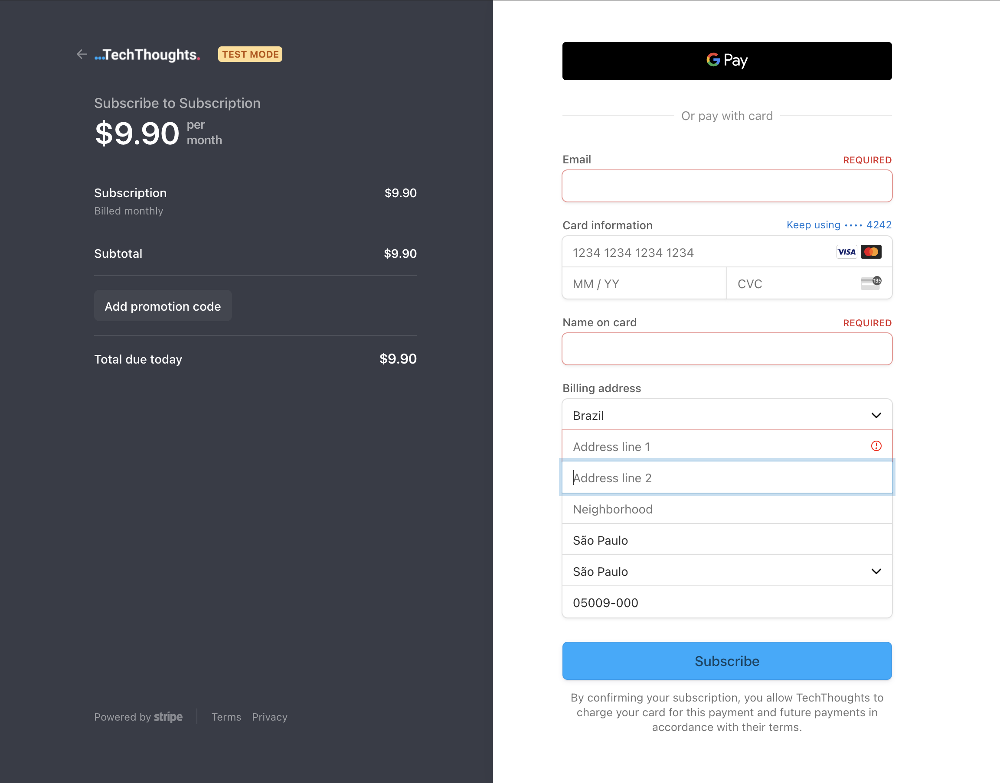
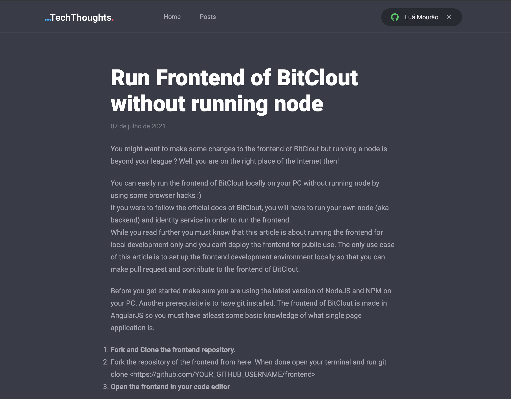

<h1 align="center">...TechThoughts.</h1>
<p align="center">Aplicação web estilo blog para publicação de textos, pensamentos e anotações dos profissionais com o cargo de Tech Lead. O conteúdo das publicações poderá ser acessado mediante o pagamento de uma mensalidade. Para implementar o projeto como uma JAMStack, foram utilizados os serviços de um headless CMS para guardar os posts, uma API de dados para guardar informações úteis de usuários/assinaturas e a API Routes do Next.js, tanto para autenticação OAuth quanto para a comunicação com a plataforma de pagamentos</p>

<p align="center">:coffee:</p>

<p align="center">
  <a href="#principais-funcionalidades">Funcionalidades</a> &#xa0; | &#xa0; 
  <a href="#status">Status</a> &#xa0; | &#xa0;
  <a href="#tecnologias">Tecnologias</a> &#xa0; | &#xa0;
  <a href="#fluxo-em-imagens">Imagens</a> &#xa0; &#xa0; | &#xa0;
  <a href="#executando-o-projeto-na-sua-máquina">Executando</a> &#xa0; &#xa0;
</p>

---

</br>
<h2>Principais Funcionalidades</h2>
- Autenticação com provedor terceiro (OAuth) Github</br>
- Integração com a plataforma de pagamento Stripe</br>
- Consumo de um Headless CMS (Prismic) para obtenção dos posts</br>
- Preview de cada post para acesso público</br>
- Acesso privado ao post completo, mediante verificação de login e assinatura ativa</br>
- Configuração do webhook do Stripe para monitorar mudanças no status de pagamento das assinaturas</br></br>

<h2>Status</h2>
Finalizada</br></br>

<h2>Tecnologias utilizadas</h2>
- React</br>
- Next.js</br>
- TypeScript</br>
- Sass</br>
- FaunaDB</br></br>

<h2>Fluxo em imagens</h2>

| Homepage sem autenticação do usuário |
|-------|
||

| Página de posts (hover no primeiro post) | Preview de post para usuário não autenticado/inscrito |
|-------|-------|
|||

| Homepage com autenticação do usuário | Ao clicar no botão "Subscribe now" o usuário é encaminhado para a página de pagamento do Stripe |
|-------|-------|
|||

| Depois de concluir o pagamento, acesso ao post completo | Caso o usuário finalize sua sessão, o post volta para o modo preview |
|-------|-------|
|||

</br>
<h2>Executando o projeto na sua máquina</h2>
Para executar o projeto você vai precisar acessar a plataforma do FaunaDB e criar as collections "users" e "subcriptions" e na plataforma do Stripe, criar o produto "subscription". Além disto, você precisa criar os posts diretamente no Prismic CMS</br></br>

Com as informações do FaunaDB, do Stripe e do Prismic CMS, você deve seguir o exemplo do arquivo ".env.local.example" para criar um arquivo ".env.local" na raiz do projeto com as credenciais válidas dos serviços.</br>

Depois disto, basta rodar os seguintes comandos na pasta do projeto:
```bash
# Install dependencies
$ yarn

# Run the project
$ yarn dev

# The server will initialize in the <http://localhost:3000>
```
